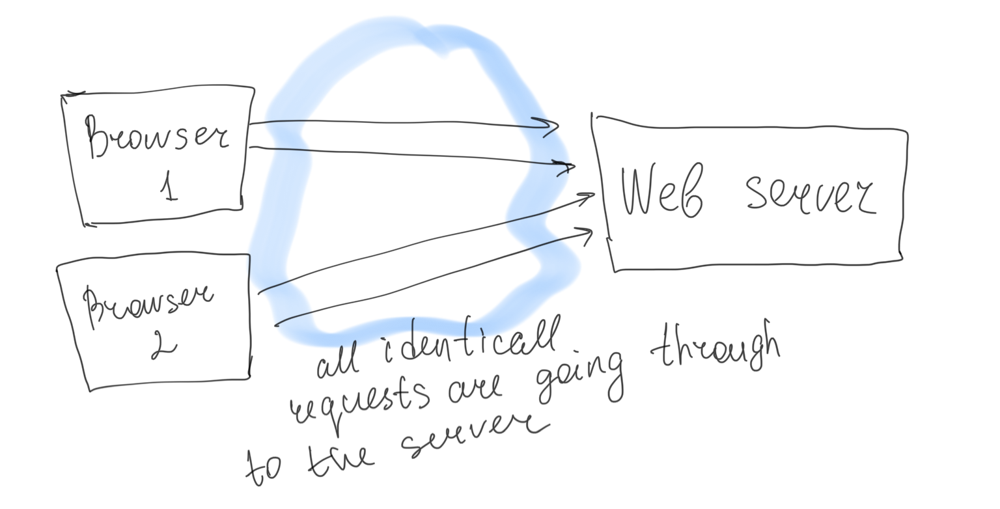
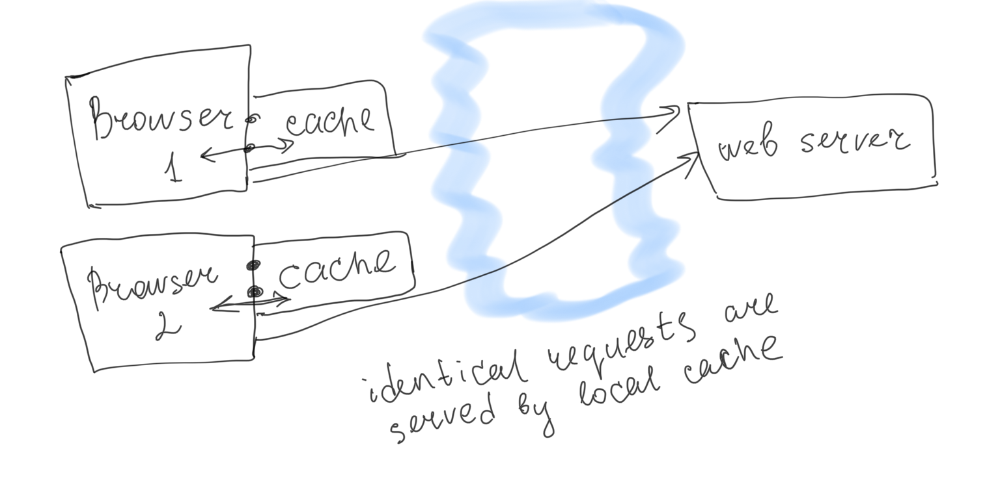

# Caching

- `Private browser caches` is dedicated to a single user.
Read more https://developer.mozilla.org/en-US/docs/Web/HTTP/Caching
- `Shared proxy caches` is dedicated to be reused by more than one user.

There are several kinds of caches: these can be grouped into two main categories: private or shared caches. A shared cache is a cache that stores responses for reuse by more than one user. A private cache is dedicated to a single user. This page will mostly talk about browser and proxy caches, but there are also gateway caches (symphony), CDN, reverse proxy caches and load balancers that are deployed on web servers for better reliability, performance and scaling of web sites and web applications.

- 

    
No cache

    
   

- 

    
Private browser cache

    
   

- Service Worker - a proxy which sits between browser, server and application. Can be used for caching and assess th application in offline.
- IndexDb - for caching data in browser
